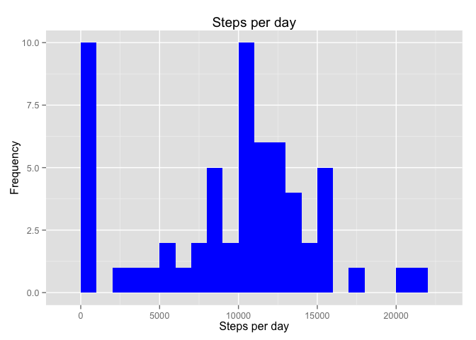
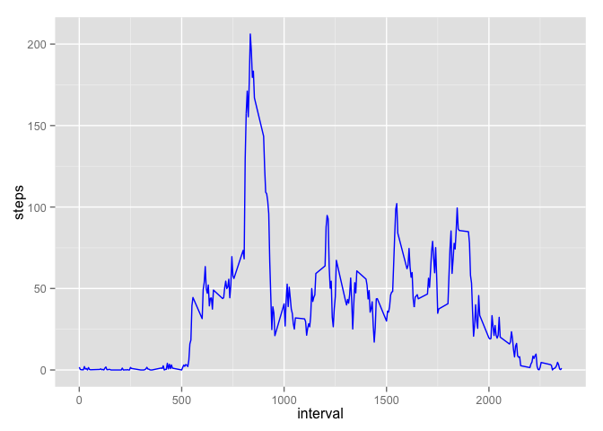
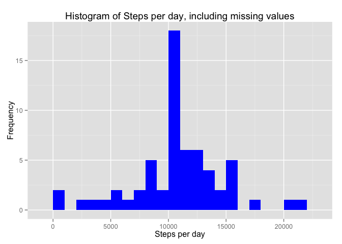

# Reproducible Research: Peer Assessment 1


## Loading and preprocessing the data


Read in the data from the activity file


```r
data <- read.csv("activity.csv", header = TRUE, sep = ',', colClasses = c("numeric", "character","integer"))
```


Load in the libraries being used.


```r
library(dplyr)
```

```
## 
## Attaching package: 'dplyr'
## 
## The following objects are masked from 'package:stats':
## 
##     filter, lag
## 
## The following objects are masked from 'package:base':
## 
##     intersect, setdiff, setequal, union
```

```r
library(lubridate)
library(ggplot2)
```

Change date into dateformat using as.Date

```r
data$date <- as.Date(data$date)
```


```r
head(data)
```

```
##   steps       date interval
## 1    NA 2012-10-01        0
## 2    NA 2012-10-01        5
## 3    NA 2012-10-01       10
## 4    NA 2012-10-01       15
## 5    NA 2012-10-01       20
## 6    NA 2012-10-01       25
```


## What is mean total number of steps taken per day?

 1) Calculate total steps taken in a day:
 
Aggregate the number of steps in a day by date, using group_by

```r
steps <- data %>%
  group_by(date) %>%
  summarize(steps = sum(steps,na.rm=TRUE)) 
steps
```

```
## Source: local data frame [61 x 2]
## 
##          date steps
##        (date) (dbl)
## 1  2012-10-01     0
## 2  2012-10-02   126
## 3  2012-10-03 11352
## 4  2012-10-04 12116
## 5  2012-10-05 13294
## 6  2012-10-06 15420
## 7  2012-10-07 11015
## 8  2012-10-08     0
## 9  2012-10-09 12811
## 10 2012-10-10  9900
## ..        ...   ...
```

2) Make a histrogram of total steps perday


```r
ggplot(steps, aes(x = steps)) + geom_histogram(fill = "blue", binwidth = 1000) + labs(title = "Steps per day", x = "Steps per day", y = "Frequency")
```

 

 3) Calculate the mean and median of the total number of steps taken per day

```r
mean_steps <- mean(steps$steps, na.rm = TRUE)
median_steps <- median(steps$steps, na.rm = TRUE)

mean_steps
```

```
## [1] 9354.23
```

```r
median_steps
```

```
## [1] 10395
```


## What is the average daily activity pattern?

a) Calculate the average number of steps taken in each 5-minute interval per day 


```r
intv <- data  %>%
  group_by(interval) %>%
  summarize(steps = mean(steps,na.rm=TRUE))
```

Plot


```r
ggplot(intv, aes(x=interval, y=steps)) + geom_line(color = "blue")
```

 

Which 5-minute interval, on average across all the days in the dataset, contains the maximum number of steps?.

 

```r
intv[which.max(intv$steps),]
```

```
## Source: local data frame [1 x 2]
## 
##   interval    steps
##      (int)    (dbl)
## 1      835 206.1698
```


## Imputing missing values


Calculate and report the total number of missing values in the dataset (i.e. the total number of rows with NAs).

```r
sum(is.na(data$steps))
```

```
## [1] 2304
```

Create a new dataset that is equal to the original dataset but with the missing data filled in by using mean steps in an interval.


```r
imputed.data<- data %>%
  group_by(interval)  %>%
  mutate(steps= ifelse(is.na(steps), mean(steps, na.rm=TRUE),steps))

head(imputed.data)
```

```
## Source: local data frame [6 x 3]
## Groups: interval [6]
## 
##       steps       date interval
##       (dbl)     (date)    (int)
## 1 1.7169811 2012-10-01        0
## 2 0.3396226 2012-10-01        5
## 3 0.1320755 2012-10-01       10
## 4 0.1509434 2012-10-01       15
## 5 0.0754717 2012-10-01       20
## 6 2.0943396 2012-10-01       25
```


Check to see if there any missing values. There are none.

```r
sum(is.na(imputed.data$steps))
```

```
## [1] 0
```

Make a histogram of the total number of steps taken each day and Calculate and report the mean and median total number of steps taken per day.

```r
steps_imputed<- imputed.data %>%
  filter(!is.na(steps)) %>%
  group_by(date) %>% summarize(steps = sum(steps)) 

ggplot(steps_imputed, aes(x = steps)) +
  geom_histogram(fill = "blue", binwidth = 1000) +
  labs(title = "Histogram of Steps per day, including missing values", x = "Steps per day", y = "Frequency")
```

 

Do these values differ from the estimates from the first part of the assignment? What is the impact of imputing missing data on the estimates of the total daily number of steps?


```r
mean_steps_imputed <- mean(steps_imputed$steps, na.rm = TRUE)
mean_steps_imputed
```

```
## [1] 10766.19
```

```r
median_steps_imputed <- median(steps_imputed$steps, na.rm = TRUE)
median_steps_imputed
```

```
## [1] 10766.19
```
The impact of imputing missing data with the average number of steps in the same 5-min interval is that both the mean and the median are equal to the same value: 10766.

Are there differences in activity patterns between weekdays and weekends?
